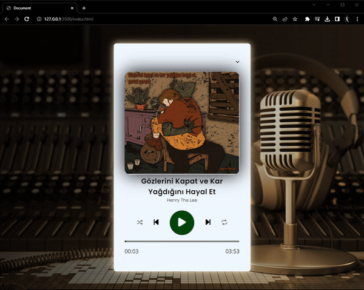

# MP3 PLAYER JS PROJECT

Bu projede indexten veri çekme, butonları kontrol etme ve yönetme gibi temel JS komutları yanı sıra zamana dayalı işlemler de gerçekleştirdik.
 

Saniye olarak gelen süreyi dakikaya çevirip yazdırdık. Çalma listesi oluşturup player ile arasında geçişler yaptık.

 ---------   ---------   ---------

In this project, we performed basic JavaScript commands such as fetching data from the index, controlling and managing buttons, as well as time-based operations.

We converted the time received in seconds to minutes and displayed it. We created a playlist and made transitions between the player.

Proje Görüntüsü - Project View 

